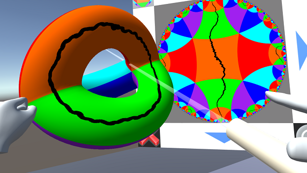

# GenusLab VR

A VR experience for Oculus Rift + Touch to explore drawing on a genus two surface and its universal cover, which updates both pictures in real time.  This is meant to be used to understand the universal covering of a hyperbolic surface.  Developed in [Unity 3D](http://unity3d.com/unity).

## Development Status

Alpha.  Basic drawing (and erasing) features work, but the interface is rather spartan and there is no in-app help or documentation.

This program was developed in a Fall 2018 project in the [Mathematical Computing Laboratory](http://mcl.math.uic.edu/) at UIC.

## Requirements

### For building

* [Unity 3D](http://unity3d.com/unity); developed in version 2018.2.1f1
* Oculus Rift headset
* Oculus Touch controllers

### For running a binary release

* Windows 10
* Oculus Rift headset
* Oculus Touch controllers

## Developers

* Alexander Adrahtas (<aadrah2@uic.edu>)
* David Dumas (<david@dumas.io>)
* Alexander Guo (<alx168@gmail.com>)
* Gregory Schamberger (<gscham2@uic.edu>)
